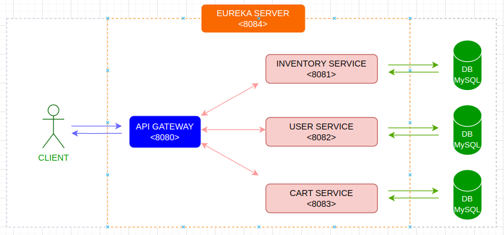
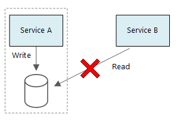

# Shopping Cart Web App - REST Microservices architecture

- **Inventory Service**: Add item to the site, only admin role can manage the inventory.
- **User Service**: manage all users service and create new users
- **Cart Service**: manages customers shopping carts with CRUD operations.
- **API Gateway**: Route requests to multiple services using a single endpoint. This service allows us to expose multiple services on a single endpoint and route to the appropriate service based on the request.

### 3. data model
   

## default configuration

| Service               | Port |
|-----------------------| --   |
| api-gateway           | 8080 |
| inventory-service     | 8081 |
| user-service          | 8082 |
| cart-service          | 8083 |
| discovery-service     | 8084 |

### Project folder structure
- api-gateway: API Gateway
- inventory-service: Inventory Service
- external-files: external files
- user-service: User Service
- cart-service: Cart Service